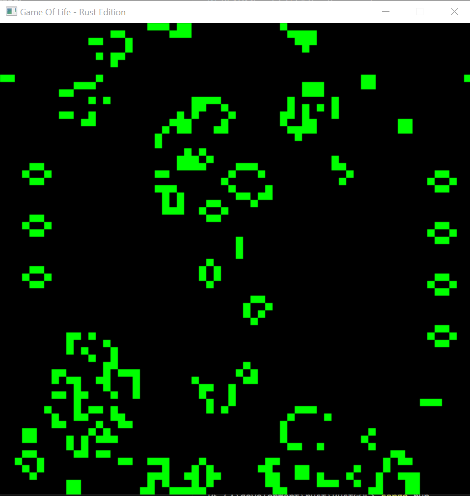

# RustGOL - Rust Game Of LIfe

A simple implementation of Game of Life using Rust and minifb for rendering. 
This is a simple toy application to experiment with Rust for rendering. This is not
intended to be a new / perfect / optimised implementation. 

## Build
The build process requires Rust to be installed.

```
git clone https://github.com/cainmartin/RustGOL.git
cd RustGOL
cargo build --release
cargo run --release
```



# Implementation details

The Game of Life is a great project to test out a language (or refresh your memory) as it uses a lot of the most common 
programming concepts, has some interesting challenges and is a relatively small project.

## Use of minifb
I used the MiniFB (Mini Frame Buffer) crate because it offererd the quickest way to get a pixel on screen. It is of course possible to
use other libraries such as Piston / Bevy or even WGPU, but because the goal was to write an implementation of Game Of Life, it was clear
this library had all the required functionality and was very lightweight allowing me to concentrate on the GOL implementation.

https://crates.io/crates/minifb

# Future plans
There is no time line for this - but there are some features I would like to add including, but not limited to:

- Add further configurability such as the ability to change colors, frame rate etc
- Add the ability to paint your own patterns
- Work on performance / optimisations - the current implementation is a bit naive
- Configurable map sizes
- Ability to load a configuration from a source file